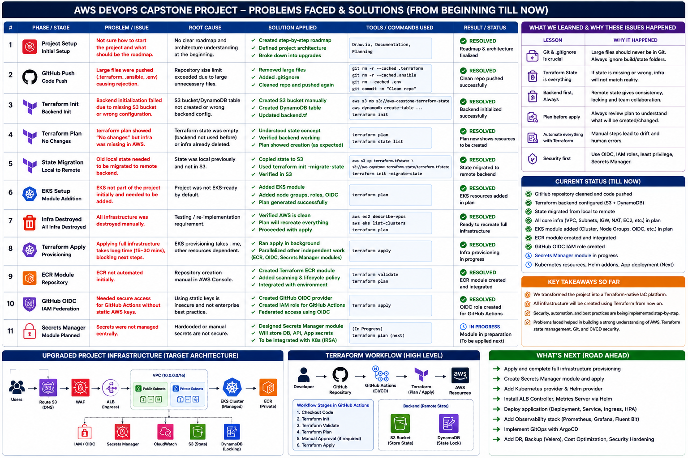

# 🚀 AWS Enterprise Platform Engineering Capstone

### Production-Grade AWS DevOps Platform with Terraform, EKS, CI/CD, Security & Cloud Automation

<p align="center">
  
</p>

<p align="center">
  
  
  
  
  
  
</p>

<p align="center">
  
  
  
  
  
  
</p>

---

## 📋 Table of Contents

- [Executive Summary](#-executive-summary)
- [Architecture Overview](#-architecture-overview)
- [Technology & Skill Mapping](#-technology--skill-mapping)
- [Business Problem Solved](#-business-problem-solved)
- [Before vs After Transformation](#-before-vs-after-transformation)
- [STAR Methodology](#-star-methodology)
- [Terraform Architecture](#-terraform-architecture)
- [Remote Backend Architecture](#-remote-backend-architecture)
- [EKS Platform Architecture](#-eks-platform-architecture)
- [Kubernetes Workload Architecture](#-kubernetes-workload-architecture)
- [Security Architecture](#-security-architecture)
- [CI/CD Pipeline](#-cicd-pipeline)
- [Project Structure](#-project-structure)
- [Key Engineering Achievements](#-key-engineering-achievements)
- [Challenges & Solutions](#-challenges--solutions)
- [Security Implementation](#-security-implementation)
- [Infrastructure Provisioning](#-infrastructure-provisioning)
- [Deployment Workflow](#-deployment-workflow)
- [Getting Started](#-getting-started)
- [Monitoring Roadmap](#-monitoring-roadmap)
- [Future Upgrades](#-future-upgrades-roadmap)
- [Resume Highlights](#-resume-worthy-project-highlights)
- [Key Learning Outcomes](#-key-learning-outcomes)
- [Author](#-author)

---

## 🎯 Executive Summary

This project is a **full-scale enterprise AWS DevOps platform** built to simulate how senior platform engineering teams design, provision, secure, deploy, monitor, and automate cloud-native workloads in production.

Every architectural decision reflects real-world enterprise requirements — modular infrastructure, passwordless CI/CD authentication, hardened Kubernetes runtime, container security scanning, remote state management, and audit-grade observability.

> **This is not a tutorial project. This is a production engineering portfolio.**

### 🏆 Platform Highlights at a Glance

| Dimension | What Was Built |
|---|---|
| **Infrastructure** | Modular Terraform with remote state (S3 + DynamoDB locking) |
| **Networking** | Production VPC — public/private subnets, NAT, IGW, route tables |
| **Compute** | Amazon EKS with managed node groups |
| **Registry** | Amazon ECR with vulnerability scanning |
| **CI/CD** | 4-workflow GitHub Actions pipeline with zero static AWS credentials |
| **Authentication** | GitHub OIDC federation → IAM role assumption |
| **Security** | Trivy image + IaC scanning, SSM-only EC2, non-root containers |
| **Config Management** | Ansible playbooks + roles over SSM (no SSH) |
| **Packaging** | Helm chart with parameterized, rollback-capable deployments |
| **Application** | Containerized Python Flask service deployed to EKS |

---

## 🏗️ Architecture Overview

<p align="center">
  
</p>

The platform follows a layered architecture with clear separation between networking, compute, security, and delivery concerns:

```
Developer → GitHub Repository
                │
                ▼
    ┌─────────────────────────┐
    │   GitHub Actions CI/CD  │
    │  ┌─────────────────────┐│
    │  │ Terraform CI        ││
    │  │ App Build + Push    ││
    │  │ EKS Deploy (Helm)   ││
    │  │ Security Scan       ││
    │  └─────────────────────┘│
    └────────────┬────────────┘
                 │
     GitHub OIDC (passwordless)
                 │
                 ▼
         AWS IAM Role Assumption
                 │
    ┌────────────┴────────────┐
    │                         │
    ▼                         ▼
AWS Networking            EKS Cluster
VPC / Subnets             Managed Node Group
NAT Gateway               Kubernetes
IGW / Route Tables        Helm → Flask App
EC2 (SSM-only)            LoadBalancer → Users
IAM / Security Groups

Observability: CloudWatch · Fluent Bit · Container Insights · SNS
Security:      CloudTrail · IAM Access Analyzer · VPC Flow Logs · Trivy
```

---

## 🗺️ Technology & Skill Mapping

<p align="center">
  
</p>

| Category | Technology | Purpose |
|---|---|---|
| ☁️ Cloud | AWS | Core cloud platform |
| 🏗️ Infrastructure as Code | Terraform | Modular, repeatable provisioning |
| ⚙️ Configuration Management | Ansible | Automated EC2 configuration over SSM |
| 🐳 Containers | Docker | Application containerization |
| 📦 Registry | Amazon ECR | Secure container image storage |
| 🎯 Orchestration | Amazon EKS | Managed Kubernetes |
| 📋 Packaging | Helm | Kubernetes deployment management |
| 🔄 CI/CD | GitHub Actions | Automated build, test, deploy |
| 🔐 Auth | GitHub OIDC | Passwordless AWS federation |
| 📊 Monitoring | CloudWatch | Metrics, logs, dashboards |
| 📝 Logging | Fluent Bit | Container log forwarding |
| 🔔 Alerting | SNS | Email-based operational alerts |
| 🛡️ Security Scanning | Trivy | Container + IaC vulnerability scanning |
| 🔑 Secrets | AWS Secrets Manager | Runtime secret retrieval |
| 🌐 Networking | VPC + NAT + IGW | Enterprise network segmentation |
| 💾 State Backend | S3 + DynamoDB | Remote Terraform state with locking |

---

## 💼 Business Problem Solved

Modern enterprises operating at scale face compounding infrastructure risks when platform engineering is treated as an afterthought:

### ❌ Without This Platform

| Problem | Business Impact |
|---|---|
| Manual infrastructure provisioning | Configuration drift, inconsistency across environments |
| Static AWS credentials in CI/CD | Critical credential exposure and audit failures |
| SSH-accessible EC2 instances | Expanded attack surface, compliance violations |
| Ad-hoc container deployments | No rollback, no version control, no repeatability |
| No security scanning in pipeline | Vulnerabilities reach production undetected |
| Absent observability | Blind spots, slow incident response, poor SLAs |
| No infrastructure state management | Concurrent changes cause corruption and outages |

### ✅ With This Platform

- **Repeatable provisioning** via modular Terraform — zero manual steps
- **Passwordless CI/CD** via GitHub OIDC — eliminates credential sprawl
- **SSM-only compute access** — no SSH exposure, full audit trail
- **Helm-based deployments** — versioned, parameterized, rollback-capable
- **Security-gated pipelines** — Trivy catches vulnerabilities before production
- **Remote state backend** — S3 + DynamoDB prevents concurrent state corruption
- **Container Insights + SNS** — operational visibility with proactive alerting

---

## 🔄 Before vs After Transformation

<p align="center">
  
</p>

| Dimension | Before | After |
|---|---|---|
| Infrastructure | Manual console clicks | Modular Terraform IaC |
| State Management | Local `.tfstate` | Remote S3 + DynamoDB |
| CI/CD Auth | Static IAM keys | GitHub OIDC federation |
| Compute Access | SSH open to internet | SSM-only, no SSH |
| Container Runtime | Root user, no hardening | Non-root, read-only FS |
| Deployments | `kubectl apply` manually | Helm with rollback |
| Security Validation | None | Trivy image + IaC scan |
| Secrets | Hardcoded in config | AWS Secrets Manager |
| Observability | No metrics or alerts | CloudWatch + SNS |
| Audit Trail | None | CloudTrail + VPC Flow Logs |

---

## ⭐ STAR Methodology

<p align="center">
  
</p>

<details>
<summary><strong>📌 Situation</strong></summary>

Modern enterprises deploying cloud-native applications face significant engineering risk when infrastructure is provisioned manually, CI/CD pipelines rely on static credentials, container workloads lack security hardening, and observability is absent or reactive.

This project was designed to simulate and solve the exact challenges a platform engineering team faces when building a production AWS environment from first principles — covering networking, compute, containerization, orchestration, security, and automation.

</details>

<details>
<summary><strong>🎯 Task</strong></summary>

Design, build, and document a complete enterprise-grade AWS DevOps platform that demonstrates:

- Modular, reusable infrastructure as code
- Production-safe CI/CD with zero static credentials
- Hardened Kubernetes runtime on EKS
- Container and infrastructure security scanning
- Remote state management with locking
- Configuration management over SSM
- Observability with metrics, logs, and alerting
- Comprehensive audit and compliance controls

</details>

<details>
<summary><strong>⚡ Action</strong></summary>

**Infrastructure (Terraform):**
- Designed a 7-module Terraform architecture covering VPC, EC2, EKS, ECR, IAM, Security Groups, and GitHub OIDC
- Implemented remote state backend with S3 versioning and DynamoDB state locking
- Enforced explicit resource dependency ordering to prevent race conditions

**Security:**
- Configured GitHub OIDC federation — completely eliminating static AWS credentials from CI/CD
- Restricted EC2 access to SSM only — zero SSH exposure
- Applied Kubernetes runtime hardening: non-root, read-only filesystem, dropped Linux capabilities
- Integrated Trivy scanning for both container images and IaC files in CI pipeline

**CI/CD:**
- Built four GitHub Actions workflows: Terraform CI, App Build + ECR Push, EKS Helm Deploy, Security Scan
- All workflows authenticate via OIDC with scoped IAM role assumption

**Observability:**
- Deployed CloudWatch Container Insights for CPU/memory/pod metrics
- Configured Fluent Bit for container log forwarding
- Built custom CloudWatch dashboard with threshold alarms and SNS email alerting

**Configuration Management:**
- Authored Ansible playbooks for EC2 bootstrap and application deployment
- Used `community.aws.aws_ssm` for all remote execution — no SSH required

</details>

<details>
<summary><strong>📈 Result</strong></summary>

| Outcome | Detail |
|---|---|
| **Zero static credentials** | All CI/CD authentication via OIDC — eliminates #1 cause of cloud breaches |
| **12 active security controls** | Trivy, OIDC, SSM-only, non-root containers, CloudTrail, IAM Analyzer, VPC Flow Logs, Secrets Manager, ECR scanning |
| **Fully automated infrastructure** | VPC → EKS → ECR → Helm deployment, zero manual steps |
| **Modular, reusable IaC** | 7 Terraform modules — composable across environments |
| **Production-grade Helm packaging** | Versioned, rollback-capable deployments to EKS |
| **Remote state safety** | S3 + DynamoDB backend prevents state corruption under concurrent operations |
| **End-to-end pipeline** | Git push → security scan → build → deploy, fully automated |

</details>

---

## 🧱 Terraform Architecture

<p align="center">
  
</p>

The Terraform codebase is structured as reusable, composable modules — mirroring how enterprise platform teams manage infrastructure at scale.

### Module Breakdown

| Module | Resources Provisioned |
|---|---|
| `vpc` | VPC, public/private subnets, IGW, NAT Gateway, route tables |
| `ec2` | Private EC2 instance, SSM instance profile |
| `eks` | EKS cluster, managed node groups, OIDC provider |
| `ecr` | Container registry with vulnerability scanning |
| `iam-ec2` | EC2 instance role, SSM policy attachment |
| `security-group` | Ingress/egress rules, scoped traffic controls |
| `github-oidc` | OIDC provider, trust policy, GitHub → AWS IAM federation |

### Provisioning Workflow

<p align="center">
  
</p>

```bash
# 1. Bootstrap remote state (one-time)
cd terraform/bootstrap
terraform init && terraform apply

# 2. Provision environment
cd terraform/environments/dev
terraform init
terraform validate
terraform plan
terraform apply
```

---

## 🗄️ Remote Backend Architecture

<p align="center">
  
</p>

Terraform state is managed remotely using:

| Component | Purpose |
|---|---|
| **S3 Bucket** | Stores `terraform.tfstate` with versioning enabled |
| **DynamoDB Table** | State locking — prevents concurrent apply corruption |
| **Bootstrap module** | Provisions the backend resources before all other infrastructure |

```hcl
terraform {
  backend "s3" {
    bucket         = "aws-enterprise-capstone-tfstate"
    key            = "dev/terraform.tfstate"
    region         = "us-east-1"
    dynamodb_table = "terraform-state-lock"
    encrypt        = true
  }
}
```

> **Why this matters:** Without remote state locking, concurrent Terraform operations corrupt the state file — a production outage risk at any team scale above one person.

---

## ☸️ EKS Platform Architecture

<p align="center">
  
</p>

### Cluster Configuration

| Setting | Value |
|---|---|
| Control Plane | AWS-managed (EKS) |
| Node Groups | Managed node groups |
| OIDC Provider | Enabled (required for IRSA) |
| Authentication | Access entries + admin policy |
| Networking | Private node groups in VPC private subnets |

### Access Model

```
GitHub Actions
     │
     │ OIDC Token
     ▼
AWS IAM Role (scoped)
     │
     │ kubeconfig
     ▼
EKS Cluster API
     │
     ▼
Helm Deploy → Kubernetes Namespace → Flask Deployment → LoadBalancer
```

---

## 🐳 Kubernetes Workload Architecture

<p align="center">
  
</p>

All workloads are deployed via Helm with the following runtime security controls enforced:

```yaml
securityContext:
  runAsNonRoot: true
  readOnlyRootFilesystem: true
  allowPrivilegeEscalation: false
  capabilities:
    drop: ["ALL"]
```

### Kubernetes Resources

| Resource | Purpose |
|---|---|
| `Deployment` | Flask application with replica management |
| `Service` (LoadBalancer) | External traffic ingestion |
| `Namespace` | Workload isolation |
| `ConfigMap` | Application configuration |
| `ServiceAccount` | IRSA-ready workload identity |

---

## 🔐 Security Architecture

<p align="center">
  
</p>

### Active Security Controls

| Control | Status | Detail |
|---|---|---|
| GitHub OIDC Federation | ✅ Active | Passwordless AWS auth — no static keys |
| No Static AWS Credentials | ✅ Active | Zero `AWS_ACCESS_KEY_ID` in CI/CD |
| SSM-only EC2 Access | ✅ Active | No SSH, full SSM audit trail |
| Non-root Containers | ✅ Active | `runAsNonRoot: true` enforced |
| Read-only Container FS | ✅ Active | `readOnlyRootFilesystem: true` |
| Dropped Linux Capabilities | ✅ Active | `capabilities.drop: ["ALL"]` |
| Trivy Image Scanning | ✅ Active | Runs on every `app-ci` build |
| Trivy IaC Scanning | ✅ Active | Runs on every push |
| ECR Vulnerability Scanning | ✅ Active | Enabled on repository |
| CloudTrail | ✅ Active | Full API audit logging |
| IAM Access Analyzer | ✅ Active | External access detection |
| VPC Flow Logs | ✅ Active | Network traffic audit trail |

---

## 🔄 CI/CD Pipeline

<p align="center">
  
</p>

### Pipeline Architecture

```
Git Push / PR
     │
     ├──► terraform.yml        → init · validate · fmt · plan
     │
     ├──► app-ci.yml           → checkout · OIDC auth · ECR login · docker build · push
     │
     ├──► security-scan.yml    → Trivy image scan · Trivy IaC scan
     │
     └──► deploy.yml           → OIDC auth · kubeconfig · cluster validation · helm upgrade
```

### Workflow Details

<details>
<summary><strong>terraform.yml — Infrastructure Quality Gate</strong></summary>

```yaml
steps:
  - Checkout
  - Setup Terraform
  - terraform init
  - terraform validate
  - terraform fmt --check
  - terraform plan
```

Runs on every push to validate IaC quality before any apply.

</details>

<details>
<summary><strong>app-ci.yml — Build & Publish</strong></summary>

```yaml
steps:
  - Checkout
  - Configure AWS credentials (OIDC)
  - Login to ECR
  - Build Docker image
  - Push to ECR
```

Produces a tagged, production-ready image in ECR on every merge.

</details>

<details>
<summary><strong>deploy.yml — EKS Deployment</strong></summary>

```yaml
steps:
  - Configure AWS credentials (OIDC)
  - Update kubeconfig
  - Validate cluster auth
  - helm upgrade --install
  - Verify rollout status
```

Deploys to EKS via Helm with rollout verification.

</details>

<details>
<summary><strong>security-scan.yml — Enterprise Security Gate</strong></summary>

```yaml
steps:
  - Trivy image scan (container vulnerabilities)
  - Trivy IaC scan (Terraform misconfigurations)
```

Blocks deployments with critical vulnerabilities.

</details>

---

## 📁 Project Structure

```
aws-enterprise-capstone/
│
├── .github/
│   └── workflows/
│       ├── app-ci.yml          # Docker build + ECR push
│       ├── deploy.yml          # EKS Helm deployment
│       ├── security-scan.yml   # Trivy image + IaC scanning
│       └── terraform.yml       # Terraform quality gate
│
├── ansible/                    # EC2 config management (SSM-based)
├── app/                        # Python Flask application + Dockerfile
├── docs/                       # Architecture docs and diagrams
├── helm/                       # Helm chart for EKS deployment
├── k8s/                        # Raw Kubernetes base manifests
├── monitoring/                 # CloudWatch configs, dashboards
├── screenshot/                 # Architecture diagrams
├── scripts/                    # Utility and automation scripts
├── security/                   # Security policies and configs
│
└── terraform/
    ├── bootstrap/              # Remote state backend (S3 + DynamoDB)
    ├── environments/
    │   └── dev/                # Dev environment root module
    └── modules/
        ├── vpc/                # VPC, subnets, NAT, IGW, routes
        ├── ec2/                # Private EC2 with SSM profile
        ├── eks/                # EKS cluster + node groups
        ├── ecr/                # Container registry
        ├── github-oidc/        # OIDC provider + IAM trust
        ├── iam-ec2/            # EC2 IAM role + SSM policy
        └── security-group/     # Security group rules
```

---

## 🏆 Key Engineering Achievements

| # | Achievement | Technical Detail |
|---|---|---|
| 1 | **Zero Static Credentials** | GitHub OIDC → IAM role assumption; `id-token: write` permission; no `AWS_ACCESS_KEY_ID` anywhere |
| 2 | **Modular Terraform** | 7 independent modules, composable across environments, remote state with DynamoDB locking |
| 3 | **Production EKS** | Managed node groups, OIDC provider for IRSA, access entry authentication model |
| 4 | **Hardened Containers** | Non-root user, read-only filesystem, dropped capabilities, minimal base image |
| 5 | **Security-gated CI/CD** | Trivy blocks builds with critical CVEs; IaC scan catches misconfigurations before apply |
| 6 | **SSM-only Compute** | No SSH on any EC2; all access via Systems Manager with full audit trail |
| 7 | **Helm Packaging** | Versioned, parameterized, rollback-capable deployments with `helm upgrade --install` |
| 8 | **Remote State Safety** | S3 versioning + DynamoDB locking prevents state corruption under concurrent operations |

---

## 🧩 Challenges & Solutions

<p align="center">
  
</p>

<details>
<summary><strong>⚠️ Challenge 1 — Terraform Resource Dependency Ordering</strong></summary>

**Problem:** Terraform attempted to create dependent resources (NAT Gateway, route tables) before prerequisites (Elastic IP, Internet Gateway) were ready.

**Root Cause:** Implicit dependency inference missed cross-module relationships.

**Solution:** Introduced explicit `depends_on` declarations at module boundaries. Established a consistent provisioning order: VPC → IGW → Elastic IP → NAT → Route Tables → Subnets → Compute.

**Lesson:** At module boundaries, Terraform cannot infer dependencies — they must be declared explicitly.

</details>

<details>
<summary><strong>⚠️ Challenge 2 — IAM Propagation Delays</strong></summary>

**Problem:** IAM role creation succeeded but policy attachments were not immediately usable, causing downstream resource failures.

**Root Cause:** AWS IAM is eventually consistent — new policies take seconds to propagate globally.

**Solution:** Added propagation wait logic and retry handling for IAM-dependent operations. Applied `aws_iam_role_policy_attachment` with explicit `depends_on` to enforce ordering.

</details>

<details>
<summary><strong>⚠️ Challenge 3 — EKS Authentication Failures</strong></summary>

**Problem:** `kubectl` commands failed with auth denied errors after EKS cluster creation.

**Root Cause:** The EKS cluster creator (Terraform IAM role) was not automatically granted `system:masters` under the new access entry model.

**Solution:** Switched to the access entry authentication model. Added explicit access entry for the deployment IAM role with `AmazonEKSClusterAdminPolicy`.

</details>

<details>
<summary><strong>⚠️ Challenge 4 — GitHub OIDC Permission Failure</strong></summary>

**Problem:** GitHub Actions OIDC token exchange failed with `Could not load credentials`.

**Root Cause:** The workflow was missing `id-token: write` permission, preventing GitHub from issuing OIDC tokens.

**Solution:** Added `permissions: id-token: write` and `contents: read` at the workflow level.

</details>

<details>
<summary><strong>⚠️ Challenge 5 — Trivy Action Version Mismatch</strong></summary>

**Problem:** Security scan pipeline failed with `unable to find version` for the Trivy action.

**Root Cause:** Pinned to a deprecated action version that was no longer published.

**Solution:** Updated to the current stable `aquasecurity/trivy-action` reference. Removed SARIF upload dependency (GitHub Advanced Security restriction on public repos).

</details>

<details>
<summary><strong>⚠️ Challenge 6 — SSM Connectivity for Ansible</strong></summary>

**Problem:** Ansible could not connect to EC2 instances — no SSH port was open (by design).

**Root Cause:** Standard Ansible SSH transport incompatible with SSM-only access model.

**Solution:** Switched to `community.aws.aws_ssm` connection plugin. EC2 instance profile includes `AmazonSSMManagedInstanceCore` policy.

</details>

---

## 🔒 Security Implementation

### Defence in Depth Model

```
Layer 1 — Identity & Access
  └── GitHub OIDC federation (no static keys)
  └── IAM least-privilege roles
  └── IAM Access Analyzer

Layer 2 — Network
  └── VPC private subnets for all compute
  └── Security groups (scoped ingress/egress)
  └── NAT Gateway (no direct internet exposure)
  └── VPC Flow Logs

Layer 3 — Compute
  └── SSM-only EC2 access
  └── No public IP on application instances
  └── CloudTrail API audit logging

Layer 4 — Container
  └── ECR vulnerability scanning
  └── Trivy pre-deploy image scanning
  └── Non-root container execution
  └── Read-only root filesystem
  └── Dropped Linux capabilities

Layer 5 — Secrets
  └── AWS Secrets Manager (no hardcoded values)
  └── IRSA-scoped pod access (planned)

Layer 6 — Audit & Compliance
  └── CloudTrail (all API calls)
  └── VPC Flow Logs (all network traffic)
  └── IAM Access Analyzer (external access detection)
```

---

## 🔧 Infrastructure Provisioning

```bash
# Step 1 — Bootstrap remote state backend
cd terraform/bootstrap
terraform init
terraform apply

# Step 2 — Initialize environment
cd terraform/environments/dev
terraform init

# Step 3 — Review changes
terraform validate
terraform fmt --check
terraform plan -out=tfplan

# Step 4 — Apply
terraform apply tfplan

# Step 5 — Verify
aws eks describe-cluster --name aws-enterprise-capstone
kubectl get nodes
```

---

## 🚀 Deployment Workflow

```bash
# Configure kubeconfig
aws eks update-kubeconfig \
  --region us-east-1 \
  --name aws-enterprise-capstone

# Verify cluster access
kubectl get pods -A
kubectl get svc -A

# Deploy via Helm
helm upgrade --install aws-enterprise-capstone ./helm/aws-enterprise-capstone \
  --namespace production \
  --create-namespace \
  --set image.tag=$IMAGE_TAG \
  --wait

# Verify rollout
kubectl rollout status deployment/aws-enterprise-capstone -n production
```

---

## 🛠️ Getting Started

### Prerequisites

| Tool | Version | Purpose |
|---|---|---|
| Terraform | >= 1.5 | Infrastructure provisioning |
| AWS CLI | >= 2.x | AWS authentication and operations |
| kubectl | >= 1.27 | Kubernetes cluster management |
| Helm | >= 3.x | Kubernetes package management |
| Docker | >= 24.x | Container build |
| Ansible | >= 2.14 | EC2 configuration management |

### Local Setup

```bash
# 1. Clone the repository
git clone https://github.com/<your-username>/aws-enterprise-capstone.git
cd aws-enterprise-capstone

# 2. Configure AWS credentials (for local development)
aws configure

# 3. Bootstrap Terraform backend
cd terraform/bootstrap
terraform init && terraform apply

# 4. Provision infrastructure
cd ../environments/dev
terraform init && terraform apply

# 5. Build application image
cd ../../app
docker build -t aws-enterprise-capstone .

# 6. Deploy to EKS
aws eks update-kubeconfig --region us-east-1 --name aws-enterprise-capstone
helm upgrade --install aws-enterprise-capstone ../../helm/aws-enterprise-capstone \
  --namespace production --create-namespace
```

---

## 📊 Monitoring Roadmap

| Phase | Component | Status |
|---|---|---|
| Phase 1 | CloudWatch Container Insights | ✅ Complete |
| Phase 1 | Fluent Bit log forwarding | ✅ Complete |
| Phase 1 | CloudWatch dashboards | ✅ Complete |
| Phase 1 | SNS alerting | ✅ Complete |
| Phase 2 | Metrics server | 🔜 Planned |
| Phase 2 | Horizontal Pod Autoscaler (HPA) | 🔜 Planned |
| Phase 2 | Prometheus | 🔜 Planned |
| Phase 2 | Grafana dashboards | 🔜 Planned |
| Phase 3 | Distributed tracing | 📋 Roadmap |
| Phase 3 | SLO/SLA alerting | 📋 Roadmap |

---

## 🗺️ Future Upgrades Roadmap

| Priority | Feature | Business Value |
|---|---|---|
| 🔴 High | **ALB Ingress Controller** | Path-based routing, SSL termination |
| 🔴 High | **IRSA hardening** | Pod-level AWS identity without node credentials |
| 🔴 High | **Secrets Manager full integration** | Zero secrets in environment variables |
| 🟡 Medium | **ArgoCD GitOps** | Declarative, auditable deployment management |
| 🟡 Medium | **Blue/Green deployments** | Zero-downtime production releases |
| 🟡 Medium | **Canary deployments** | Progressive traffic shifting, risk reduction |
| 🟡 Medium | **Multi-environment architecture** | dev / staging / prod parity |
| 🟢 Low | **Prometheus + Grafana** | Full observability stack |
| 🟢 Low | **HPA + Cluster Autoscaler** | Elastic scaling under load |
| 🟢 Low | **OPA/Kyverno policy enforcement** | Kubernetes admission control |

---

## 📄 Resume-Worthy Project Highlights

> Copy-paste ready bullets for your CV, LinkedIn, or job applications.

```
• Architected and deployed a production-grade AWS platform using modular Terraform
  (7 modules) with remote state management via S3 + DynamoDB locking

• Eliminated static AWS credentials across all CI/CD pipelines by implementing
  GitHub OIDC federation with scoped IAM role assumption

• Provisioned and managed Amazon EKS with managed node groups, deploying
  containerized workloads via Helm with versioned, rollback-capable releases

• Implemented defence-in-depth security: Trivy container + IaC scanning,
  SSM-only EC2 access, non-root Kubernetes runtime, CloudTrail audit logging,
  IAM Access Analyzer, and VPC Flow Logs

• Built a 4-workflow GitHub Actions CI/CD pipeline covering IaC quality gates,
  Docker build + ECR push, Helm deployment, and automated security scanning

• Automated EC2 configuration management using Ansible with SSM remote
  execution — no SSH access required at any layer

• Designed enterprise VPC architecture with public/private subnet segmentation,
  NAT Gateway, and scoped security groups across availability zones
```

---

## 📚 Key Learning Outcomes

| Area | Lesson |
|---|---|
| **IaC** | Modular Terraform requires explicit dependency management at module boundaries |
| **Security** | OIDC federation is the production standard — static credentials are an anti-pattern |
| **Kubernetes** | Default security contexts are insufficient — explicit hardening is mandatory |
| **CI/CD** | Security gates in the pipeline expose vulnerabilities before they reach production |
| **Observability** | Monitoring must be designed with the architecture, not bolted on after |
| **State Management** | Remote state with locking is non-negotiable for any team-scale Terraform |
| **Secrets** | Hardcoded values in any config are a critical security violation |
| **Networking** | Private subnets + NAT is the enterprise baseline — public EC2 is an anti-pattern |

---

## 👤 Author

**AWS Enterprise Platform Engineering Capstone**  
Built as a professional portfolio demonstrating senior-level AWS, DevOps, and Platform Engineering capabilities.

---

<p align="center">
  <em>Built with precision. Designed for production. Engineered for scale.</em>
</p>

<p align="center">
  
  
  
</p>
