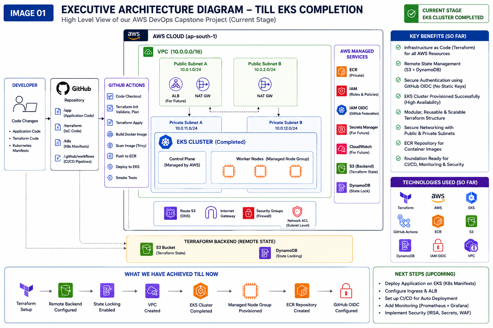
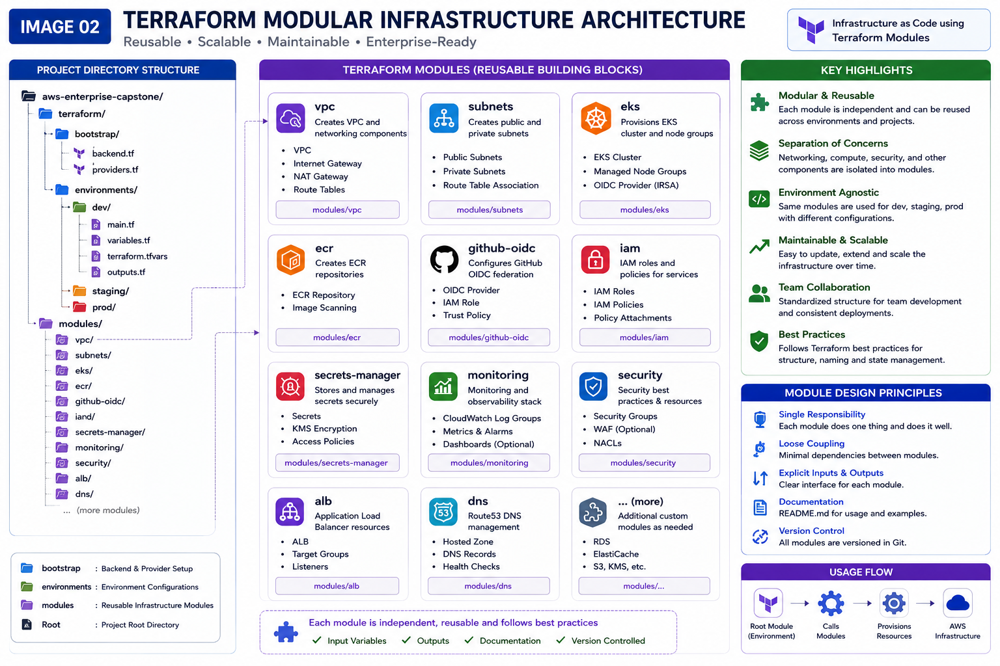
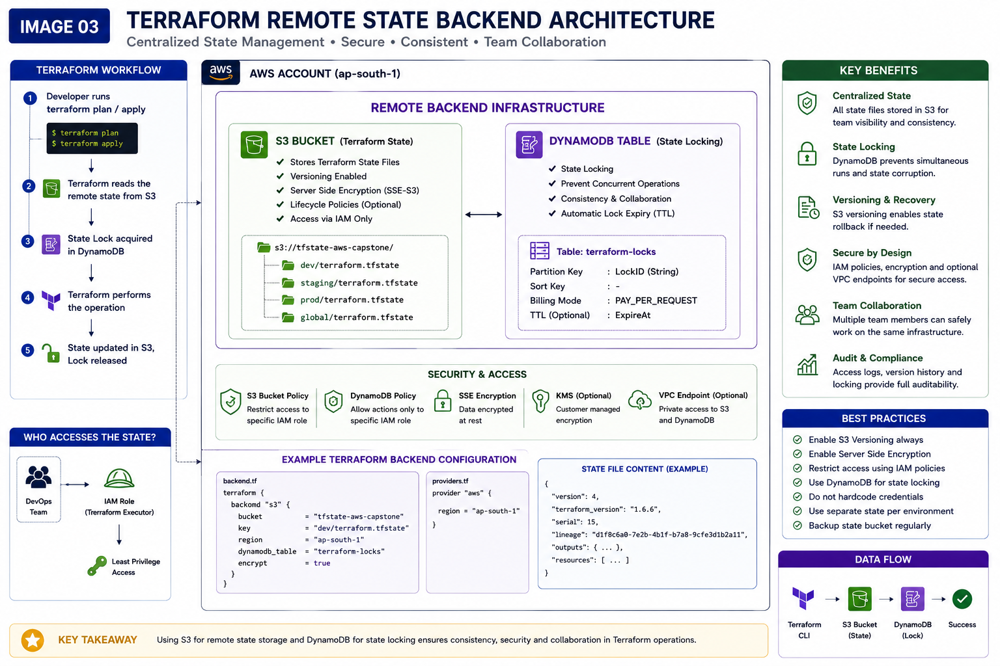
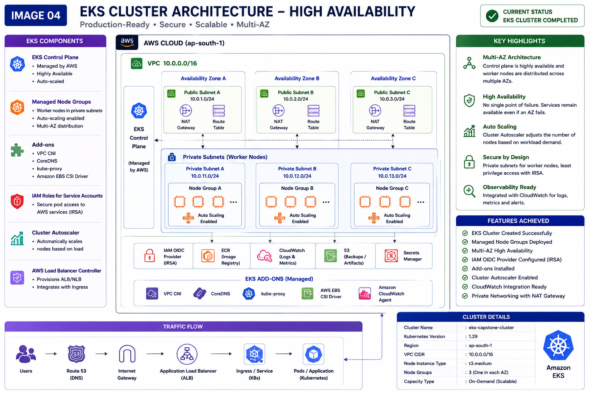
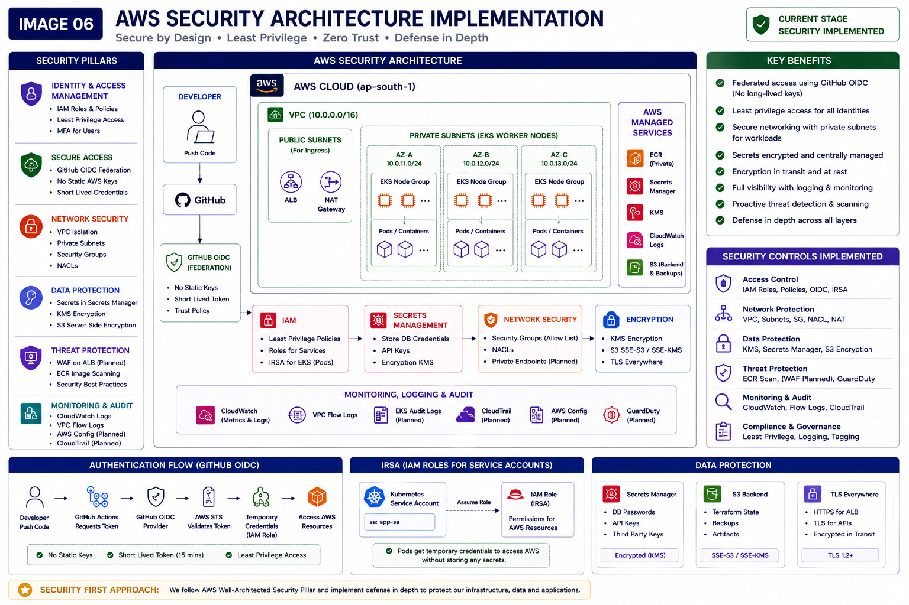
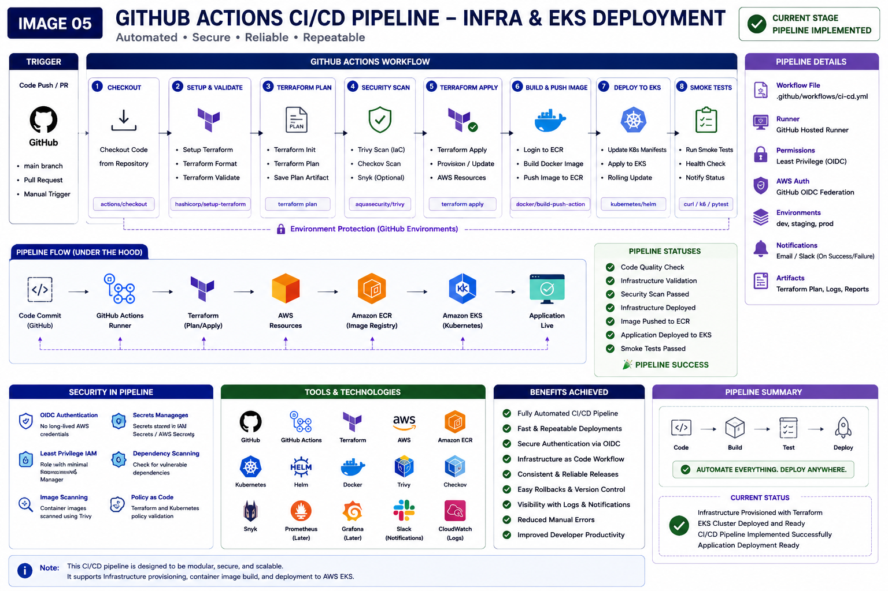
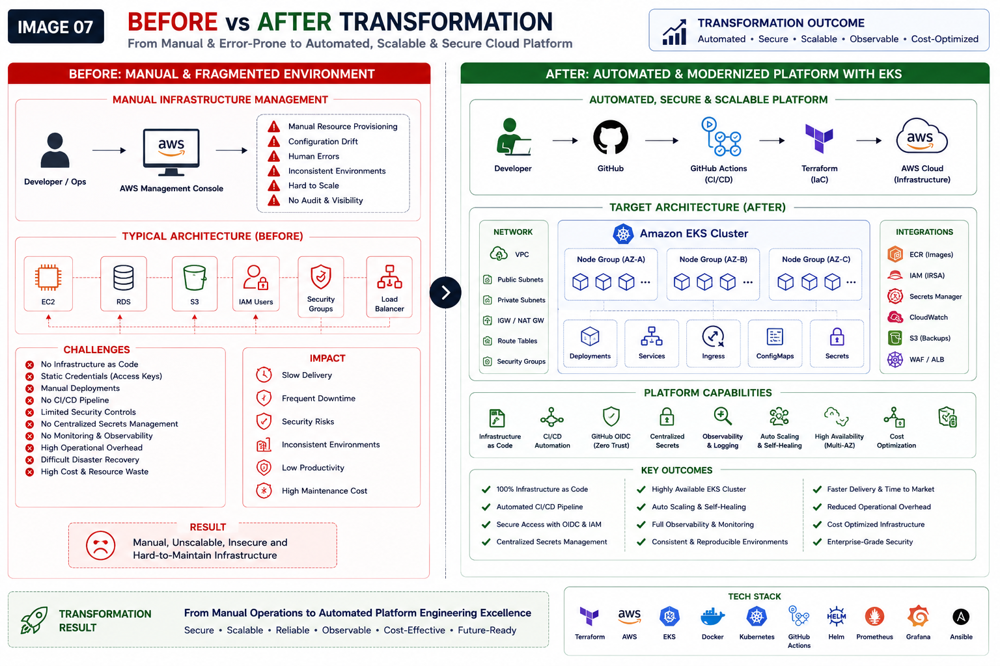

# Upgrade 01 — Terraform Native Platform Engineering Transformation

## Executive Summary

This document captures the first major modernization upgrade of the **AWS Enterprise Platform Engineering Capstone Project**.

The original project successfully demonstrated AWS infrastructure provisioning, containerization, CI/CD automation, Kubernetes deployment, and security tooling. However, the architecture still relied on hybrid infrastructure management approaches, manual dependencies, and partial automation.

Upgrade 01 transforms the project into a **Terraform-native enterprise platform engineering implementation**, making Infrastructure as Code the single source of truth for cloud infrastructure provisioning and platform lifecycle management.

This upgrade focuses on production engineering principles:

- Infrastructure as Code (IaC)
- Modular Terraform architecture
- Remote state management
- Team-safe infrastructure workflows
- Native Amazon EKS provisioning
- Secure CI/CD authentication
- Enterprise-grade infrastructure automation

---

# Upgrade Goal

## Objective

Transform the project from a hybrid DevOps implementation into a fully Terraform-native cloud platform.

### Before Upgrade

Infrastructure ownership was distributed across multiple tools:

- Terraform (partial)
- Ansible
- Shell scripts
- Kubernetes manifests
- Helm charts
- Manual AWS configuration

This created:

- infrastructure drift
- inconsistent provisioning workflows
- duplicated ownership
- local state risks
- non-repeatable deployments
- operational complexity

---

## After Upgrade Target

Single command provisioning model:

```bash
terraform apply

Terraform becomes responsible for:

networking
compute
IAM
container platform
EKS cluster
node groups
ECR repositories
GitHub OIDC integration
remote state backend

Future upgrades will extend ownership to:

Secrets Manager
Kubernetes resources
Helm deployments
observability stack
ingress controllers
autoscaling
security hardening
Business Problem

Modern engineering teams require:

reproducible infrastructure
secure CI/CD workflows
environment consistency
auditability
low operational risk
rapid infrastructure provisioning
scalable cloud-native platforms

The original architecture achieved functionality but lacked enterprise-level infrastructure governance.

Upgrade 01 addresses that gap.

Initial Architecture Challenges
1. Local Terraform State Risk

Original issue:

terraform.tfstate
terraform/terraform.tfstate
terraform/environments/dev/terraform.tfstate
terraform.tfstate.backup

Problems:

multiple state ownership
drift risk
accidental destruction
inconsistent resource tracking
unsafe team collaboration

Resolution:

audited Terraform state
identified active environment state
removed stale state files
migrated to remote backend
2. No Remote Backend

Original state management:

Local developer machine only

Risks:

no locking
state corruption
accidental overwrite
impossible team-safe workflows
weak disaster recovery posture

Resolution:

Implemented:

S3 remote backend
DynamoDB locking
encryption
versioning
3. Hybrid Infrastructure Ownership

Original ownership:

Terraform:

VPC
EC2
IAM
security groups

Manual / fragmented:

Kubernetes resources
Helm deployments
security integrations
CI/CD dependencies

Problems:

partial automation
operational inconsistency
manual steps
drift

Resolution:

Started migration to Terraform-native ownership.

4. No Native Kubernetes Platform Provisioning

Original implementation:

EKS was not provisioned natively through Terraform.

Problem:

Project was not fully cloud-native from infrastructure perspective.

Resolution:

Added native Terraform EKS module.

5. CI/CD Authentication Security Risk

Traditional pipeline pattern:

AWS_ACCESS_KEY_ID
AWS_SECRET_ACCESS_KEY

Problems:

static credentials
secret leakage risk
manual rotation
poor enterprise security posture

Resolution:

Implemented GitHub OIDC federation.

Upgrade Architecture Changes
Remote Backend Bootstrap

New infrastructure:

terraform/bootstrap

Provisioned:

S3 bucket
DynamoDB table
encryption
versioning

Terraform backend:

backend "s3" {
  bucket         = "ashish-enterprise-tf-state"
  key            = "dev/terraform.tfstate"
  region         = "ap-south-1"
  dynamodb_table = "ashish-enterprise-tf-locks"
  encrypt        = true
}

Benefits:

centralized state
safe locking
version recovery
collaborative workflows
Modular Terraform Architecture

Current module structure:

terraform/modules
├── vpc
├── ec2
├── iam-ec2
├── security-group
├── eks
├── ecr
├── github-oidc

Engineering benefits:

reusable design
clear ownership boundaries
maintainability
easier scaling
environment extensibility
Native EKS Platform Implementation

Implemented Terraform-native Amazon EKS provisioning.

Provisioned:

EKS cluster
managed node groups
cluster IAM role
worker node IAM role
EKS logging
OIDC provider
private subnet integration

Architecture:

AWS Cloud
└── VPC
    ├── Public Subnets
    │   ├── NAT Gateway
    │   └── Internet Gateway
    └── Private Subnets
        └── Amazon EKS
            ├── Control Plane
            └── Managed Node Groups

Benefits:

production-ready Kubernetes platform
managed control plane
scalability
high availability foundation
IRSA readiness
Amazon ECR Integration

Implemented Terraform-native ECR provisioning.

Provisioned:

private ECR repository
image scanning
immutable tags
lifecycle policies

Benefits:

secure image storage
automated retention
supply chain hygiene
GitHub OIDC Federation

Implemented secure GitHub Actions AWS authentication.

Flow:

GitHub Actions
→ OIDC Token
→ AWS IAM Trust Policy
→ STS AssumeRole
→ Temporary Credentials
→ AWS Resource Access

Benefits:

no static credentials
temporary auth
repo-scoped trust
enterprise security
Security Improvements

Implemented:

Identity
IAM roles
GitHub OIDC federation
least privilege direction
Network
private subnets
public/private segmentation
security groups
controlled access boundaries
Data Protection
encrypted Terraform backend
state versioning
Container Security
ECR image scanning
Current Architecture Status
Completed

Infrastructure:

VPC
subnets
NAT gateway
internet gateway
route tables
security groups
EC2
IAM
EKS
node groups
ECR
GitHub OIDC
Terraform backend

Automation:

GitHub Actions
Terraform workflows
security scanning
Ansible baseline automation
Screenshots
Executive Architecture

Terraform Architecture

Remote Backend

EKS Platform

Security

CI/CD

Transformation

Problems Faced During Upgrade

Major issues encountered:

duplicate Terraform state files
backend migration complexity
Terraform module reinitialization
EKS node provisioning issues
AWS quota / instance compatibility validation
state cleanup
environment drift detection

Engineering lesson:

Infrastructure modernization always requires governance before expansion.

Lessons Learned
Terraform Governance Matters

Infrastructure without clean state management becomes dangerous.

Backend First

Remote backend should be implemented before scaling IaC.

Security by Design

OIDC is superior to static credentials.

Modular Engineering Wins

Reusable modules improve maintainability.

Platform Thinking > Resource Thinking

Enterprise architecture focuses on systems, not isolated resources.

Remaining Work in Upgrade 01

Planned:

Secrets Manager Terraform module
Kubernetes provider integration
Helm provider integration
metrics server
AWS Load Balancer Controller
namespace provisioning
deployment provisioning
services
ingress
HPA

Target:

terraform apply

should provision complete application platform.

Upgrade 02 Preview

Future roadmap:

Observability
Prometheus
Grafana
Fluent Bit
CloudWatch dashboards
alerts
Security Hardening
IRSA refinement
Secrets Manager integration
WAF
GuardDuty
least privilege policy refinement
CI/CD Maturity
advanced deployment workflows
GitOps
ArgoCD
progressive delivery
Reliability
HPA
Cluster Autoscaler
readiness probes
liveness probes
blue/green deployment
canary rollout
Engineering Impact

This upgrade transforms the project from:

functional DevOps demo

to:

enterprise platform engineering implementation

Demonstrated competencies:

Terraform
AWS architecture
Kubernetes platform engineering
IAM security
CI/CD automation
infrastructure governance
cloud-native engineering
DevSecOps fundamentals
