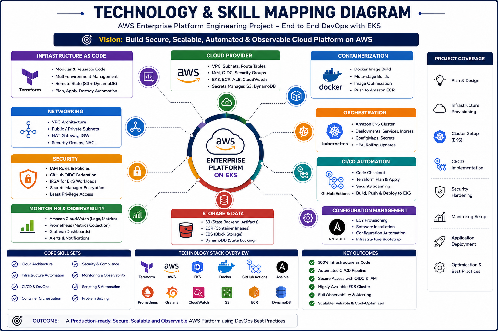
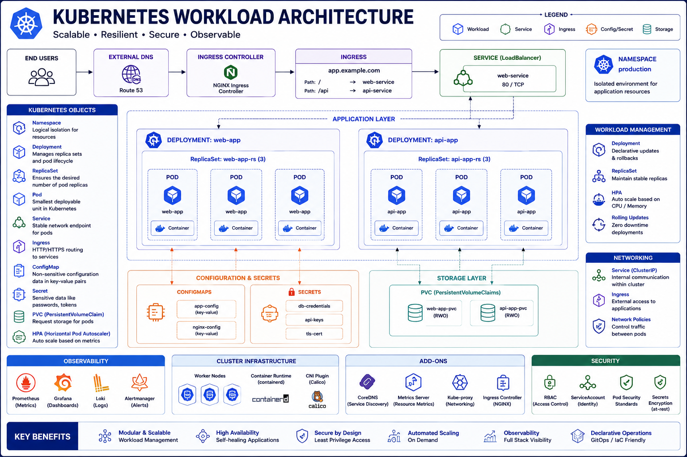

# AWS Enterprise Platform Architecture

## Executive Overview

This project implements a production-style AWS cloud platform engineering architecture using Infrastructure as Code, Kubernetes orchestration, CI/CD automation, security engineering, and cloud-native deployment practices.

Architecture goals:

- repeatable infrastructure provisioning
- secure deployment automation
- scalable container orchestration
- cloud-native operations
- modular engineering design
- production-grade platform architecture

---

# Architecture Principles

This platform follows:

- Infrastructure as Code
- Immutable infrastructure
- Cloud-native architecture
- Security by design
- Least privilege access
- Modular engineering
- Automation first
- Reproducibility

---

# High-Level Architecture

---

# Technology Stack Mapping

---

# Terraform Architecture

Terraform responsibilities:

- VPC provisioning
- subnet creation
- route tables
- NAT gateway
- internet gateway
- security groups
- IAM roles
- EC2 provisioning
- EKS provisioning
- ECR provisioning
- GitHub OIDC integration
- backend state infrastructure

---

# Remote State Architecture

Backend:

- S3 bucket
- state encryption
- versioning
- DynamoDB locking
- environment isolation

---

# EKS Platform Architecture

Components:

- managed control plane
- managed node groups
- private worker nodes
- IAM OIDC provider
- networking integration
- ECR image pull architecture

---

# Kubernetes Workload Architecture

Application layer:

- namespace
- deployment
- replica sets
- pods
- services
- ingress
- configmaps
- secrets
- HPA

---

# CI/CD Architecture

Pipeline stages:

- code checkout
- terraform validation
- terraform planning
- security scans
- docker build
- ECR push
- EKS deployment
- smoke testing

---

# Security Architecture

Controls:

- IAM
- GitHub OIDC
- private networking
- encryption
- ECR scanning
- secrets governance

---

# Current Platform Components

## Infrastructure

- AWS VPC
- subnets
- route tables
- NAT gateway
- internet gateway
- security groups
- EC2
- IAM
- Amazon EKS
- Amazon ECR
- S3 backend
- DynamoDB locking

---

## Platform

- Kubernetes
- Helm
- GitHub Actions
- Docker
- Ansible

---

# Future Architecture Roadmap

Planned:

- ALB controller
- metrics server
- HPA
- Prometheus
- Grafana
- Fluent Bit
- Secrets Manager
- IRSA
- ArgoCD
- blue/green rollout
- canary delivery
